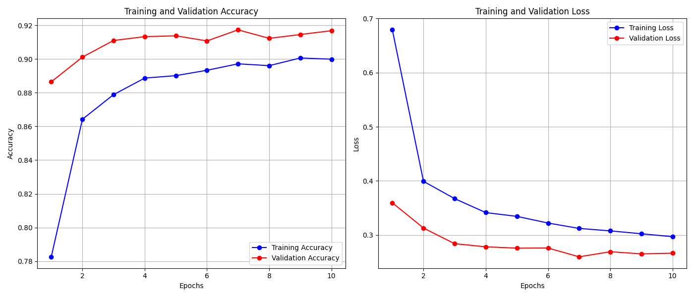
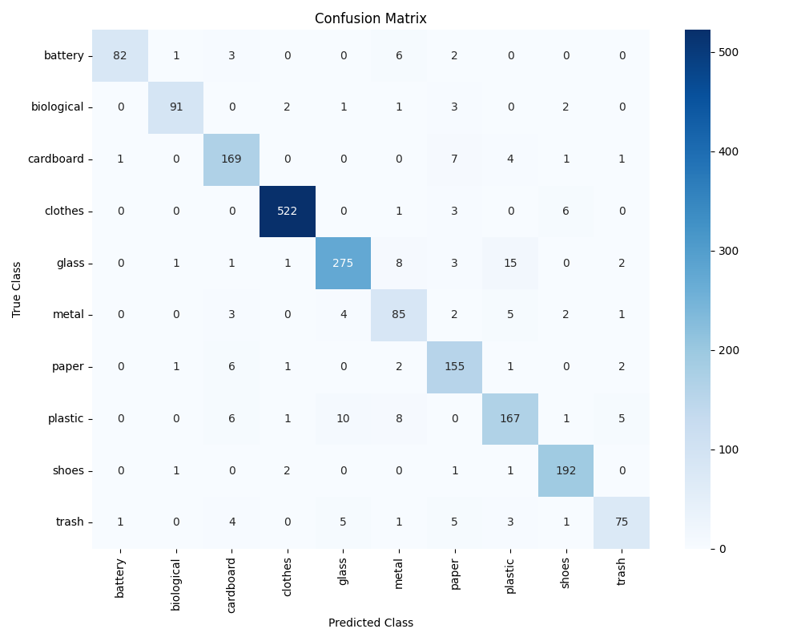

# Deteksi Sampah Otomatis dengan MobileNetV2

Proyek ini menggunakan model **MobileNetV2** untuk mengklasifikasikan berbagai jenis sampah berdasarkan citra gambar. Sistem ini mendukung edukasi pengelolaan sampah, monitoring kebersihan kota, dan aplikasi berbasis kamera HP.

---

## Dataset

- **Sumber**: [Garbage Classification v2 (Kaggle)](https://www.kaggle.com/datasets/sumn2u/garbage-classification-v2/data)
- **Jumlah gambar**: ~19.700
- **Jumlah kelas**: 10 kelas sampah rumah tangga:
  - `battery`, `biological`, `cardboard`, `clothes`, `glass`, `metal`, `paper`, `plastic`, `shoes`, `trash`

---

## Model yang Digunakan

- **Arsitektur**: `MobileNetV2` (pretrained `imagenet`, `include_top=False`)
- **Ukuran input**: 224 x 224 x 3
- **Fine-tuning**: Head klasifikasi 10 kelas
- **Augmentasi**: Rotation, flip, zoom, brightness, shear
- **Framework**: TensorFlow + Keras

---

## Hasil Pelatihan

Model dilatih selama 10 epoch dengan hasil:

- **Akurasi Training akhir**: ~90%
- **Akurasi Validasi akhir**: ~91.6%
- **Val Loss stabil & menurun** → tidak overfitting

---

## Evaluasi pada Test Set

### Akurasi Test: **92%**  
### Classification Report:

| Kelas        | Precision | Recall | F1-score |
|--------------|-----------|--------|----------|
| Battery      | 0.98      | 0.87   | 0.92     |
| Biological   | 0.96      | 0.91   | 0.93     |
| Cardboard    | 0.88      | 0.92   | 0.90     |
| Clothes      | 0.99      | 0.98   | 0.98     |
| Glass        | 0.93      | 0.90   | 0.92     |
| Metal        | 0.76      | 0.83   | 0.79     |
| Paper        | 0.86      | 0.92   | 0.89     |
| Plastic      | 0.85      | 0.84   | 0.85     |
| Shoes        | 0.94      | 0.97   | 0.96     |
| Trash        | 0.87      | 0.79   | 0.83     |

> Lihat file [`mobilenetv2_garbage_report.txt`](mobilenetv2_garbage_report.txt) untuk detail lengkap.

---

### Confusion Matrix:

> Beberapa kelas seperti **metal**, **trash**, dan **plastic** lebih sering keliru → bisa diperbaiki dengan augmentasi tambahan atau fine-tuning.

---

##  Uji Langsung: Interface Upload Gambar

Proyek ini menyediakan **interface sederhana** untuk deteksi sampah berbasis upload gambar di browser:

** Coba sekarang**: [https://grbg-detect.streamlit.app/](https://grbg-detect.streamlit.app/)
